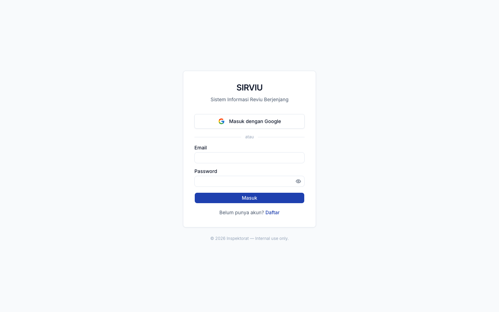
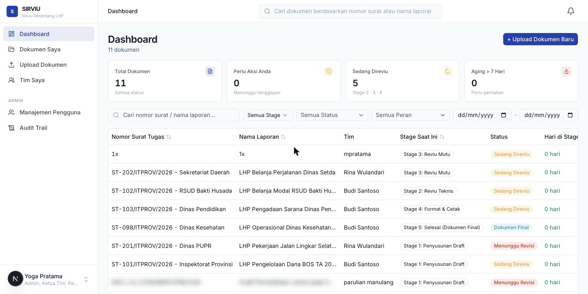
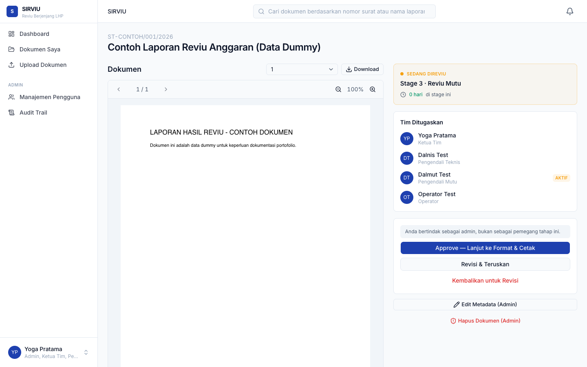
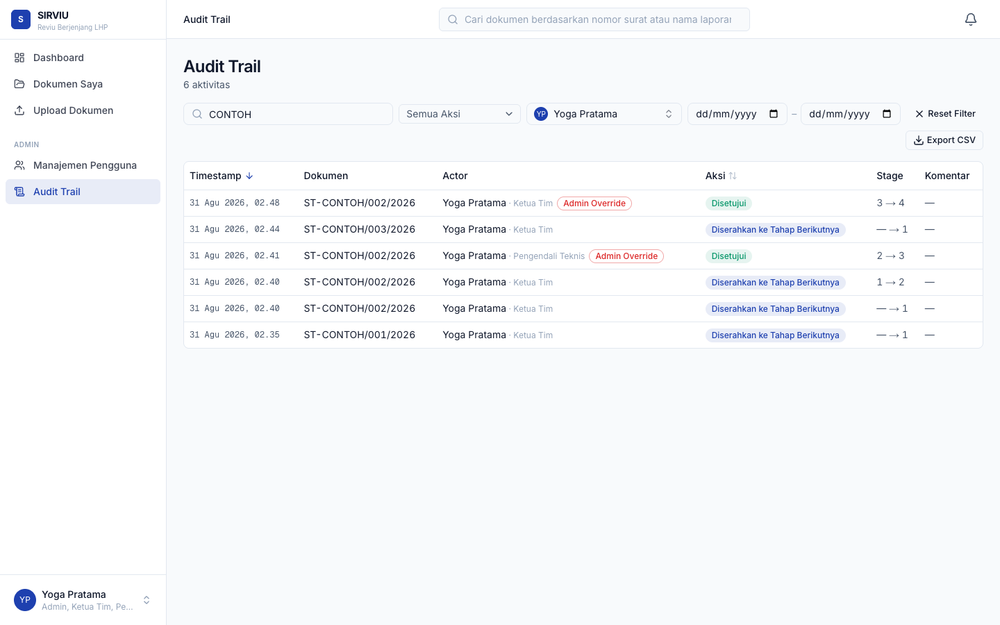
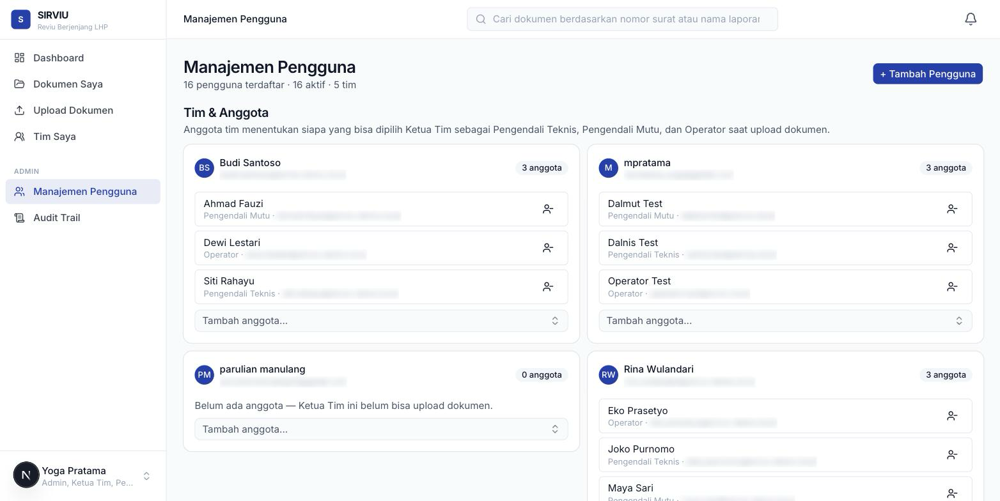

# SIRVIU

**Sistem Informasi Reviu Berjenjang** — internal tool for a regional government
Inspectorate (*Inspektorat*) in Indonesia to run its multi-stage audit report
(*LHP — Laporan Hasil Pemeriksaan*) review workflow: draft → technical review →
quality review → format/finalize, with role-gated actions, a full audit trail,
and permanent-record safeguards at every mutation.

Built solo end-to-end (schema, RLS policies, state machine, UI) as a real
production tool now used by an actual Inspectorate team, not a demo.

**Live app:** [sirviu.vercel.app](https://sirviu.vercel.app)

---

## Screenshots

| Login | Dashboard |
|---|---|
|  |  |

| Document review | Audit trail |
|---|---|
|  |  |

<details>
<summary>Admin — add user</summary>



</details>

*(Data shown is either seeded test data or dummy content created for these
screenshots — no real government document content is included in this repo
or its screenshots.)*

---

## What it does

A document moves through a fixed 5-stage pipeline. Each stage has exactly one
role who can act on it; every action is either an advance, a self-service
revision, or a return to the previous reviewer — never a silent skip.

```mermaid
flowchart LR
  KT([1 · Ketua Tim<br/>Upload])
  DN([2 · Dalnis<br/>Reviu Teknis])
  DM([3 · Dalmut<br/>Reviu Mutu])
  OP([4 · Operator<br/>Finalisasi])
  FN([5 · Dokumen Final])

  KT -- submit --> DN
  DN -- approve / revisi & teruskan --> DM
  DM -- approve / revisi & teruskan --> OP
  OP -- finalize / format-fix --> FN

  DN -. reject .-> KT
  DM -. reject .-> DN
  OP -. reject .-> DM

  classDef upload fill:#EFF4FF,stroke:#1E40AF,color:#1E40AF,rx:8,ry:8;
  classDef review fill:#ECFBFF,stroke:#0891B2,color:#0891B2,rx:8,ry:8;
  classDef ops    fill:#FEF6E7,stroke:#B45309,color:#7C4A05,rx:8,ry:8;
  classDef final  fill:#ECFDF3,stroke:#059669,color:#065F46,rx:8,ry:8;
  class KT upload; class DN,DM review; class OP ops; class FN final;
```



- **Role-scoped dashboards** — Ketua Tim, Pengendali Teknis (Dalnis),
  Pengendali Mutu (Dalmut), and Operator each see only what's actionable for
  them; Admin sees everything plus a full-access override.
- **Reviewer self-service revision** — a reviewer can fix small issues
  themselves (upload a corrected version + advance in one action) instead of
  always bouncing the document back to the original author.
- **Append-only audit trail** — every transition is logged with actor, from/to
  stage, timestamp, and comment; rejected/superseded approvals are flagged,
  never deleted.
- **Admin override with transparency** — an admin acting outside their own
  assignment is explicitly flagged (`is_admin_override`) both in the UI and in
  the audit log, so the override capability never makes the trail ambiguous.
- **Hard delete with a paper trail** — admin can permanently delete a document,
  but a full snapshot (metadata + every version + every transition) is written
  to a separate log table first, in a table that deliberately does **not**
  reference `documents` so it survives the cascade.
- **In-app notifications** — the stage holder gets notified the moment a
  document becomes actionable for them; nobody gets pinged for actions that
  don't need their response.
- **Role onboarding** — a first-time Google/email sign-in is walked through a
  one-time role picker (never "admin" — that's admin-assigned only); a
  Postgres trigger enforces it can't be replayed to escalate later.
- **Sortable, filterable tables** everywhere data lives — dashboard, user
  management, audit trail — state kept in the URL so views are shareable and
  refresh-safe.
- **Multi-team workspace isolation** — the app serves several Ketua Tim in
  parallel, each with their own Dalnis/Dalmut/Operator; one team's documents,
  including finalized ones, are invisible to another team, enforced in RLS
  policies and RPCs (not just filtered in the UI). Admin sees every team and
  can manage any team's roster from one panel.

---

## Why this stack

| | |
|---|---|
| **Next.js 16** (App Router) | Server Components for data-heavy pages (dashboard, audit trail) keep the client bundle small; Server Actions replace a separate API layer for every mutation. |
| **Supabase (Postgres + Auth + Storage)** | RLS as the actual trust boundary — not a decoration mirrored in app code. The state machine itself lives in `security definer` Postgres functions, not in TypeScript, so it can't be bypassed by calling the table directly. |
| **Tailwind v4 + shadcn/base-ui** | Design tokens in `@theme`, no separate config file to keep in sync. |
| **React Hook Form + Zod** | Same schema validates client-side (fast feedback) and server-side (the actual guarantee) — one source of truth per form. |
| **react-pdf** | Inline PDF preview in the review flow, so reviewing a report doesn't require downloading it first. |

## Architecture notes worth reading

- **The database *is* the state machine.** `submit_document`,
  `approve_review`, `reject_review`, `finalize_document`,
  `reviewer_revise_and_forward` are all `security definer` RPCs — `actor_id`
  is derived from `auth.uid()` inside the function, never trusted from a
  parameter, so it can't be forged by the caller. Stage/status transitions are
  validated in the same transaction that writes the audit row.
- **Client-side permission checks are UX, not security.**
  `lib/utils/permissions.ts` mirrors the RLS/RPC rules for instant show/hide
  in the UI, but every server action re-validates independently — a real bug
  caught during testing was exactly this gap: a reviewer-assignment rule that
  only lived in a dropdown's `disabled` prop, not in the RPC that actually
  wrote the row.
- **14 migrations, each one a real fix or a real feature**, not a rebase —
  including a workflow redesign (7-stage → 5-stage) driven by actual user
  feedback after a pilot test, done with a full data-remap migration *and* a
  written, tested rollback script kept in the repo (`supabase/rollbacks/`);
  and a multi-team isolation rollout that itself needed a follow-up
  migration once end-to-end testing (simulated sessions run directly against
  the live database) turned up two real authorization gaps — one where a
  security check trusted a client-supplied ID instead of deriving it from
  the caller.

---

## Stack

Next.js 16 (App Router, Server Components + Server Actions) · TypeScript
(strict) · Supabase (Postgres, Auth, Storage, RLS) · Tailwind CSS v4 ·
shadcn/ui on base-ui · React Hook Form + Zod · react-pdf · Vercel

## Project structure

```
app/(auth)/           # login, register — public
app/(app)/            # authenticated shell: dashboard, documents, admin, profile
components/documents/ # review workflow UI (action panel, timeline, upload)
components/admin/     # user management, audit trail
lib/actions/          # Server Actions — the only way the client mutates data
lib/constants/stages.ts   # the 5-stage definition, single source of truth
lib/utils/permissions.ts  # pure functions mirroring RLS, for UI decisions
supabase/migrations/  # schema + RPCs, applied in order
supabase/rollbacks/   # hand-written rollback for the workflow migration
```

## Running locally

```bash
pnpm install
cp .env.example .env.local   # fill in your Supabase project URL/keys
pnpm dev
```

This project talks to a **remote** Supabase project directly (no local
Supabase stack) — point `.env.local` at your own project and run the
migrations in `supabase/migrations/` in order via `supabase db push`.

---

<sub>© 2026 — built by Yoga Pratama. Internal tool, public repo for portfolio purposes.</sub>
